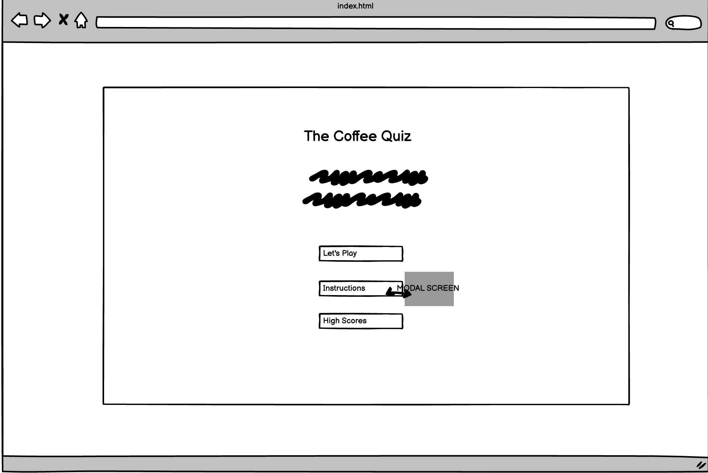
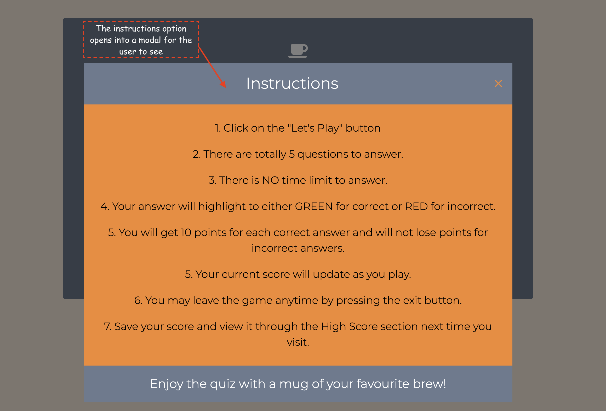
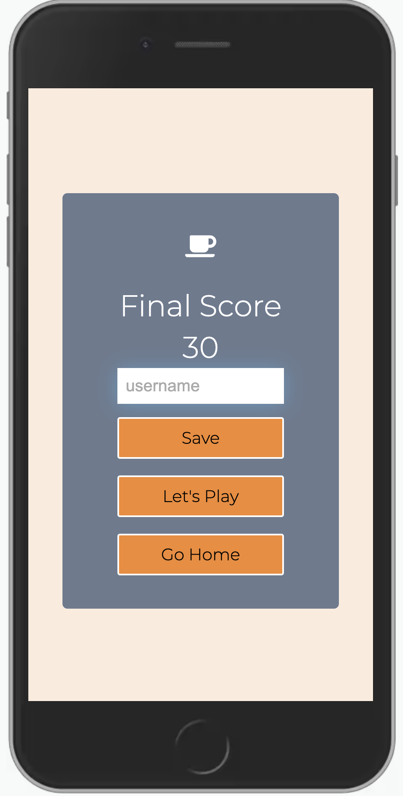
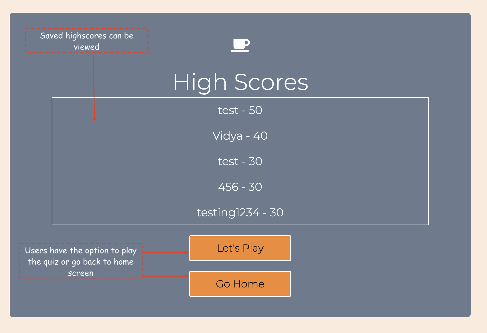
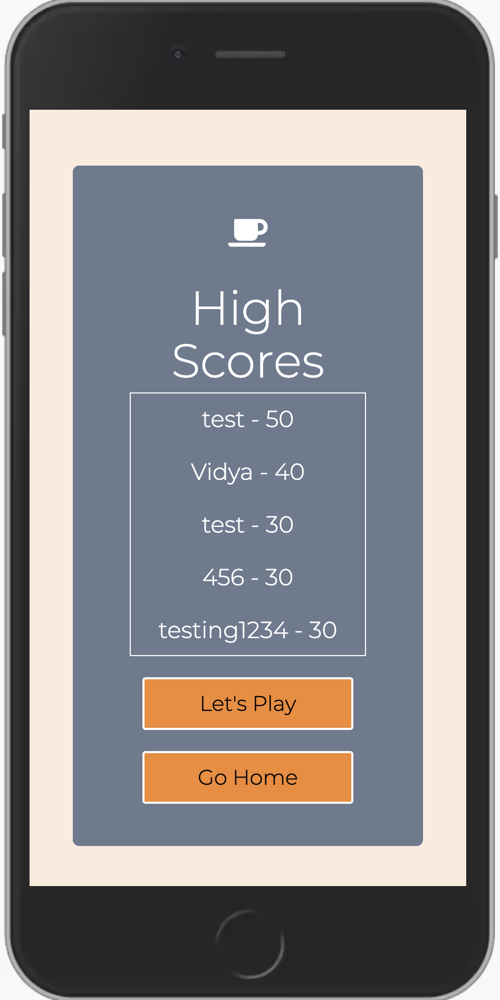
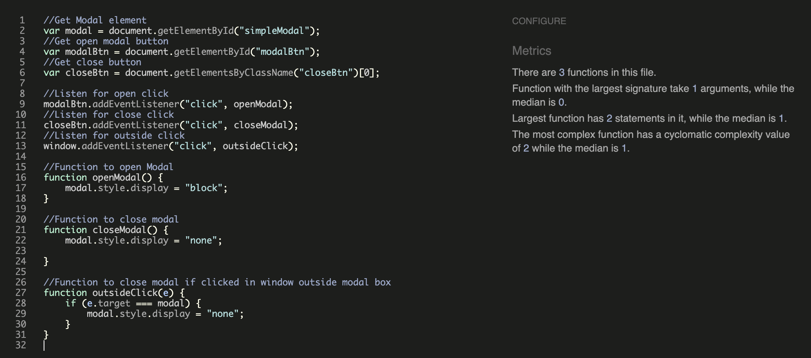
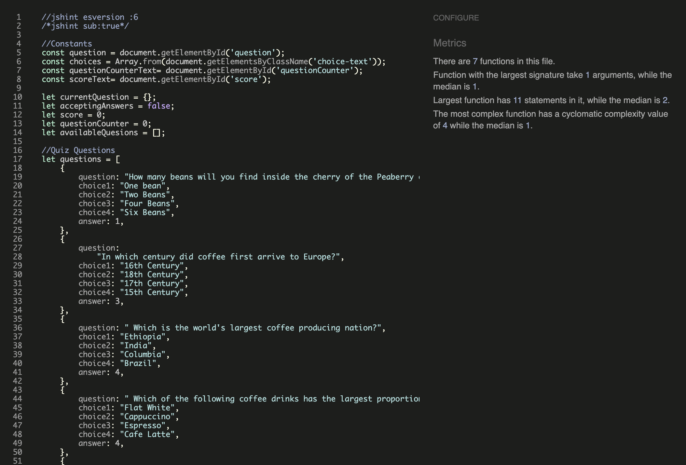

<h1 align="center">The Coffee Quiz</h1>

[View the live project here.](https://vgopal02.github.io/CoffeeQuiz/)

This is a fun quiz designed to test the  knowledge of all coffee lovers and even those who are not. Based on a set of hardcoded questions the user is tested to 5 random questions each time they play.Each correct answer is worth 10 points. No points are deducted for an incorrect answer.A display at the top of the screen allows the user to see which question they are on and a score card  shows the user their current score.The quiz also has an exit option which allows the user to leave the quiz before completion. At the end of the quiz the user may save their score with the option to play again.  

<h2 align="center"></h2>

#  User Experience (UX)

-   ### User stories

    -   #### First Time Visitor Goals

        1. As a First Time Visitor, I want to easily understand the theme of the quiz , instructions on how to play and ability to play it.
        2. As a First Time Visitor, I want to be able to easily navigate throughout the site to find content and correct option to proceed.
        3. As a First Time Visitor, I want to be able to play , record my score and view it easily.
    

    - #### Returning Visitor Goals

        1. As a Returning Visitor, I want to be able to play the quiz with different questions.

    - #### Frequent User Goals

        1. As a Frequent User, I want to be challenged to new questions in the quiz everytime.
        

-   ### Design

    - #### Color Scheme

        The main colors used are :
        1. #fddcc356 
        2. #6b7a8f 
        3. #f7882f 
        4. White & Black for Typography.
        5. Red and Green to highlight correct and incorrect answers in quiz.  
         

    - #### Typography

        
The Montserrat font is the main font used throughout the site. Montserrat is a clean font used frequently in programming, so it is both attractive and appropriate.Sans Serif is used as the fallback font. 

         

  #  Wireframes 
  
  - 
Wireframes have been created using Balsamiq.

    
    -  #### Home Page
    

       
        

    - #### Quiz Page
    

       
        
        

    - #### Conclude Page
    

       
        
        

    - #### High Scores Page
    

       
        
        

     
     
# Features

   -  ## Home Page
        -   The user is welcomed into the site with a clear header and description of the quiz.
        -   The user has three options - to be able to play the game , view instructions of the game or to view highscores generated so far.
        -   The instruction option opens up a modal where the user is able to understand how to proceed further.
        -   Font Colors have been limited to white and black to ensure text is visible against its background and clear to the user.
        - The page is responsive on all device sizes.
        

       
        
       

       
        
       

 

   -  ## Quiz Page
        -   In the quiz the user comes straight into the first question.
        -   The top left corner shows the question counter and right corner has score counter.
        -   The main body of the page has the question which gets picked at random from a database of questions which has been hardcoded.
        -   The user has the opportunity to play 5 questions at a time.
        -   The correct answer will get highlighted in green and the user will get 10 points which is added to their score .
        -   The incorrect answer will get highlighted in red and the user will not get any points. However , no points are deducted for the incorrect answer.
        -   There is a 1 second delay after the user answers a question before moving to the next one.
        -   There is an "Exit Quiz" button at the bottom of the screen which allows the user to quit the quiz and return to home page at any time.
        -   The "Exit Quiz" first opens into a modal to ensure the user definately wants to exit game. Incase they have unintentionaly pressed the exit quiz button they have the option to return to the quiz without losing their score.

       
        
       

       
        
       

 

-  ## Conclude Page
    -   In the conclusion page the user's final score is shown.
    -   The user may save the score by adding their name into the username input box and pressing save.
    -   The score is automatically saved to the highscores page and the user is taken back to the home page.
    -   It is important to note that the "Save" button is disabled by default and only gets activated when the user inputs some text into the input box.
    -   If the user does not wish to save the score they have two other options - Go back to home page or to play the game again.
    

       
        
       

  -  ## Highscores Page
        -   In the highscores page the user can view their highscores. Upto 5 of their last highscores are saved.
        -   The user can then go back to the homepage or play the quiz again.

       
        
       

 

-  ## Colors and Font Used

    - It has been ensured that background and font colors used are vision friendly. While people with different vision disabilities may not see the original color , they will be able to see and play the quiz clearly based on the [Toptal Color Blind Filter](https://www.toptal.com/designers/colorfilter?orig_uri=https://vgopal02.github.io/CoffeeQuiz/quiz.html&process_type=deutan).

    - Montserrat font with a Sans Serif backup has been used consistently through all pages of the quiz.Minimum font size used is 18px to ensure text is always clear and visible to user.

# Technologies Used

- ## Languages Used

    -   [HTML5](https://en.wikipedia.org/wiki/HTML5)
    -   [CSS3](https://en.wikipedia.org/wiki/Cascading_Style_Sheets)
    -   [Javascript](https://en.wikipedia.org/wiki/JavaScript)

-  ## Frameworks, Libraries & Programs Used

    - [Google Fonts:](https://fonts.google.com/)
    Google fonts has been used to import the 'Montserrat' font into the style.css file which is used throughout the project.

    - [Font Awesome:](https://fontawesome.com/)
    Font Awesome has been used on all pages throughout the website to add icons for aesthetic and UX purposes.

    - [Git:](https://git-scm.com/)
    Git has been used for version control by utilizing the Gitpod terminal to commit to Git and Push to GitHub.
    -  [GitHub:](https://github.com/) GitHub has been used to store the projects code after being pushed from Git.
    - [Balsamiq:](https://balsamiq.com/) Balsamiq has been used to create the wireframes during the design process.
 
 
# Testing

The W3C Markup Validator and W3C CSS Validator Services has been used to validate every page of the project to ensure there is no syntax errors in the project.

-  #### Home Page - index.html

-   #### Quiz Page - quiz.html

-   #### Conclude Page - conclude.html

-   #### HighScores Page - highscores.html

-   #### CSS - style.css
            

-   #### JavaScript

JShint has been used to verify all js code. 

-   #### Modal Page - modal.js

-   #### Quiz Page - quiz.js

-   #### Conclude Page - conclude.js

-   #### HighScores Page - highscores.js

            
### Testing User Stories from User Experience (UX) Section

-   #### First Time Visitor Goals

    1. As a First Time Visitor, I want to easily understand the theme of the quiz , instructions on how to play and ability to play it.

        1. Upon entering the site, users are automatically greeted with a relevant header and brief description of the quiz.
      
        2. This is followed by three easily readable options - to play , instructions on how to play and to be able to view saved high scores. 

    2. As a First Time Visitor, I want to be able to easily navigate throughout the site to find content.

        1. The site has been designed to be fluid and never to entrap the user. Each page has a link to go back to home page. 

        2. Each link describes the page they will end up at clearly.
        
        3. All of the information is within easy visibility of the user .

        4. Font colors and font sizes have been designed to ensure the information is clear to the user at all times.

    3. As a First Time Visitor, I want to be able to play , record my score and view it easily.

        1. The homepage clearly aloows the user to be able play the quiz.

        2. At the end of the quiz the a user is shown their final score.

        3. An input screen with a save button allows the user to save their score.

        4. The user is then provided with the option to play the quiz again or return to the homepage where they can view their saved score.

 -  #### Returning Visitor Goals

    1.  As a Returning Visitor, I want to be able to play the quiz with different questions..

        1. The questions are picked at random order from a database of hardcoded questions.

        2. This makes it a challenge for the user as they will be always be asked different questions.

-   #### Frequent User Goals

       1. As a Frequent User, I want to be challenged to new questions in the quiz everytime.
        
          1. A large database of questions have been coded for the user to be challenged with different everytime they play.

          2. The questions are also picked in random order so there will always be an element of surprise for the user.

          
   
### Further Testing

-   The Website has been tested on Google Chrome, Firefox and Safari browsers.

-   The site has been designed to be responsive on different devices - mobile to desktop.The website has been viewed on different devices such as Desktop, Laptop, different iPhones and Android devices. 

-   The website has also been viewed on a variety of different devices through Chrome Developer Tools.

-  Testing has been done to ensure that all pages are linked correctly.

-  Friends and family members  across global locations  have been asked to review the site and document any bugs and/or user experience issues.
 
 
### Known Bugs

On some smaller mobile devices longer answer choices in the quiz section overlap into the next option. As there are only two such questions with longer answer choices font sizes on smaller devices have not been reduced beyond 16px. One option to resolve the problem being considered is to extend the height of the answers option choice box in smaller screens. 
 
 
### Deployment Testing 

While the site was working at a local level, upon deployment to Github pages the site was unable to run the js code . Upon investigating the error was due to using incorrect file paths which when corrected had the site running properly.
 
 
# Deployment

### GitHub Pages

The project has been created on gitpod and deployed to GitHub Pages using the following steps...

1. Log in to GitHub and locate the [GitHub Repository](https://github.com/)

2. At the top of the Repository (not top of page), locate the "Settings" Button on the menu.

3. Scroll down the Settings page until you locate the "GitHub Pages" Section.

4. Under "Source", click the dropdown called "None" and select "Master Branch".

5. The page will automatically refresh.

6. Scroll back down through the page to locate the now published site [link](https://vgopal02.github.io/CoffeeQuiz) in the "GitHub Pages" section.
 
 
# Credits

### Code

-   [Build a Quiz](https://www.jamesqquick.com/courses/build-a-quiz-app-with-html-css-and-javascript) : For the quiz and saving user highscores. Code has been modified to better fit my needs . Tutorial Found [Here](https://www.jamesqquick.com/courses/build-a-quiz-app-with-html-css-and-javascript)

- [How To Create a Modal Box](https://www.w3schools.com/howto/howto_css_modals.asp):For the modal box .The Code has been modified to better fit my needs.

### Content

-   All content was written by the developer .

-   Questions for the quiz have been inspired by [Espresso and Coffee Guide](espressocoffeeguide.com) and [Coffee Quiz](www.coffeeteaclub.co.uk)  .

-   Colors for the site have been chosen based combinations created in [colorcombos](https://www.colorcombos.com/combomaker.html?design=pencils&output_width=75&size_option=element&colors=5D7FA1,FFF9F9,F68405,020202&background_color=FFFFFF&show_hex_flag=Y).

- Color combinations have been checked on [Toptal Color Blind Filter](https://www.toptal.com/designers/colorfilter?orig_uri=https://vgopal02.github.io/CoffeeQuiz/quiz.html&process_type=deutan) Colorblind Web Page Filter to ensure the backgroud colors and text is clearly visible to most users even if it not in original colors.

### Media
-  Screen Shots have been sourced from [AmIresponsive](http://ami.responsivedesign.is/) and Chrome GoFull PageScreen Capture.

### Inspiring Quiz/Trivia:
- [Trivia Quiz](https://constantinadrian.github.io/Trivia_Quiz)
- [Quiz Game on Flags](https://craigharrison79.github.io/MS2-Quiz-Game/)
- [Simple Javascript Quiz](https://simplestepscode.com/javascript-quiz-tutorial/)
- [Javascript Quiz with Timer](https://www.codingnepalweb.com/quiz-app-with-timer-javascript/)

### Acknowledgements

-  I would like thank my mentor Medale Oluwafemi. His guidance in giving constructive feedback through all stages of site design and development has been most valuable.

