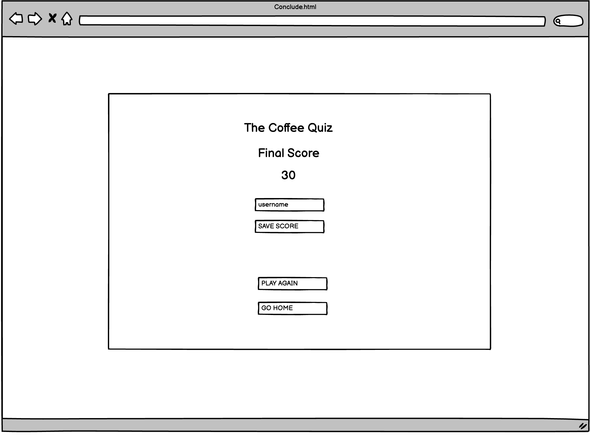
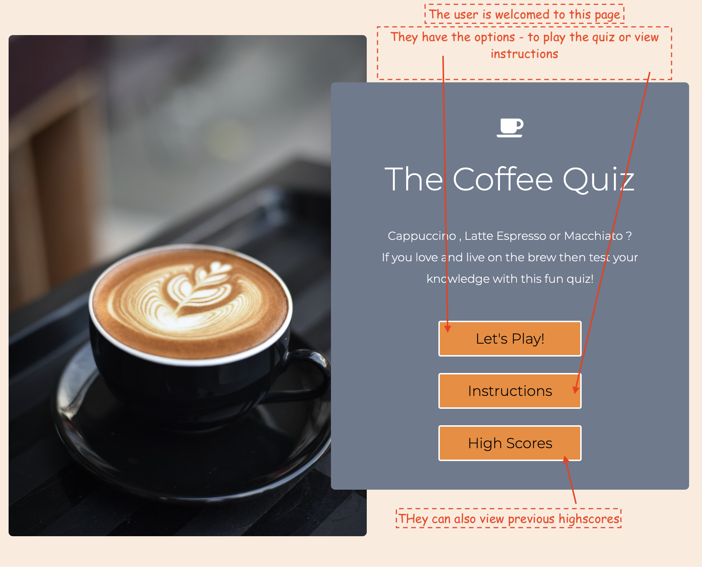
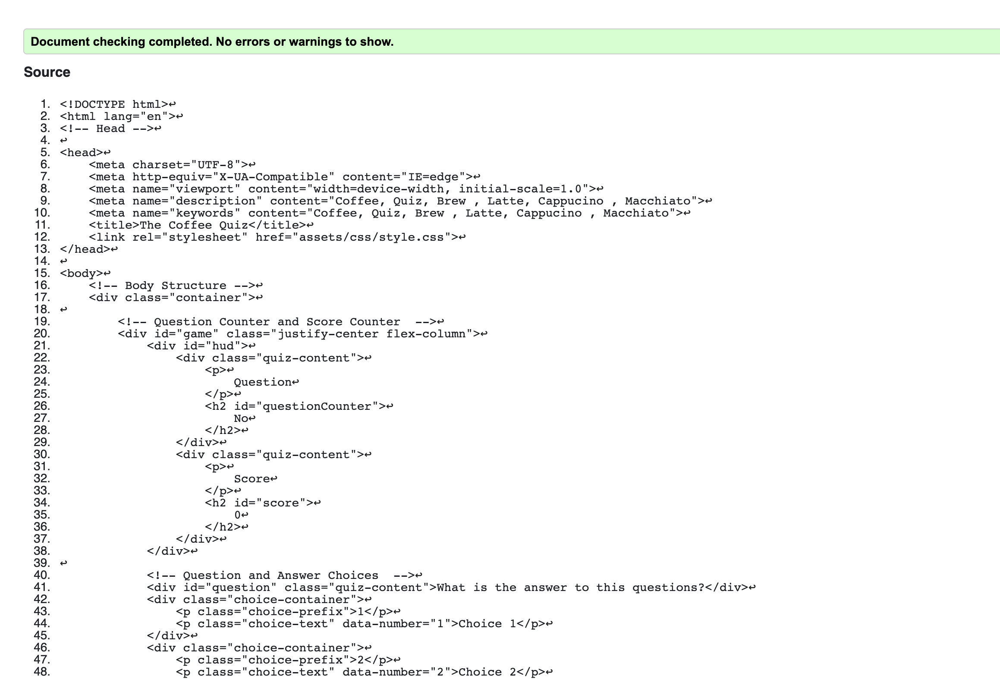
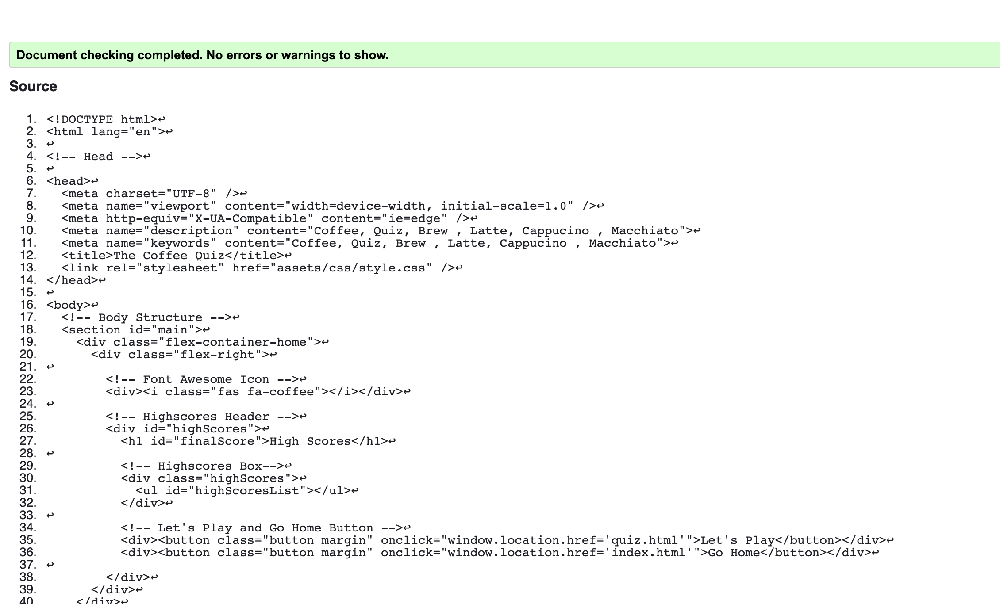

<h1 align="center">The Coffee Quiz</h1>

[View the live project here.](https://vgopal02.github.io/CoffeeQuiz/)

This is a fun quiz designed to test the  knowledge of all coffee lovers and even those who are not. Based on a set of hardcoded questions the user is tested to 5 random questions each time they play.Each correct answer is worth 10 points. A score card at the top of the screen keeps score and also allows the user to see which question they are on. Upon completion of the quiz a final the user may save their score with the option to play again.  

<h2 align="center"></h2>

#  User Experience (UX)

-   ### User stories

    -   #### First Time Visitor Goals

        1. As a First Time Visitor, I want to easily understand the theme of the quiz , instructions on how to play and ability to play it.
        2. As a First Time Visitor, I want to be able to easily navigate throughout the site to find content and correct option to proceed.
        3. As a First Time Visitor, I want to be able to play , record my score and view it easily.
    

    - #### Returning Visitor Goals

        1. As a Returning Visitor, I want to be able to play the quiz with different questions.

    - #### Frequent User Goals

        1. As a Frequent User, I want to be challenged to new questions in the quiz everytime.
        2. This will require a large database of questions.

-   #### Design

    - #### Color Scheme

    The main colors used 
        Colors used been inspired by coffee image. The main colors used are :
       
 1. #fddcc356 

       
 2. #6b7a8f 
 
       
 3. #f7882f 
 
       
 White & Black for Typography. 
 
       
 Red and Green to highlight correct and incorrect answers in quiz. 
 
 
    - #### Typography
        
The Montserrat font is the main font used throughout the whole website with Sans Serif as the fallback font in case for any reason the font isn't being imported into the site correctly. Montserrat is a clean font used frequently in programming, so it is both attractive and appropriate.

    - #### Imagery
        
 Imagery is important.The homepage image is designed to be striking and catch the user's attention. However, the use of imagery is limited in the site so as to not distract the user from the key the objective of the site which is to play the quiz. 

  #  Wireframes 
  
  - 
Wireframes have been created using Balsamiq.

    
    -  #### Home
    

       
        
        

    - #### Quiz Page
    

       
        
        

    - #### Final Page
    

       
        
        

    

# Features

   -  ## Home Page
        -   The user is welcomed into the site with striking image whilst ensuring focus of attention remains the quiz .
        -   The user has three clear options - to be able to play the game , view instructions of the game or to view highscores generated so far.
        - The instructions option opens up a modal where the user is able to understand how to proceed further.
        -   The page is responsive on all device sizes

       
        
       

       
        
       

 

   -  ## Quiz Page
        -   In the quiz the user comes straigh into the first question.
        -   The top left corner shows the question counter and right corner has score counter.
        -   The main body of the page has the question which gets picked in random from a database of questions which has been hardcoded.
        -   The user has the opportunity to play 5 questions.
        -   The correct answer will get highlighted in green and the user will get points which is added to their score .
        - The incorrect answer will get highlighted in red and the user will not get any points. However , no points are deducted for the incorrect answer.
        - There is an "exit" button at the bottom of the screen which allows the user to quit the quiz and return to home page at any time.

       
        
       

 

-  ## Conclude Page
    -   In the conclusion page the user's final score is shown.
    -   The user may save the score by adding their name into the username input box and pressing save.
    -   The score is automatically saved to the highscores page and the user is automatically taken back to the home page.
    -   It is important to note that the "Save" button is disable by default and only gets activated when the user inputs some text into the input box.
    -   If the user does not wish to save the score they have two other options - Go back to home page or to play the game again.
    

       
        
       

  -  ## Highscores Page
        -   In the highscores page the user can view their highscores. Upto 5 of their last highscores are saved.
        - The user can then go back to the homepage or play the quiz again.

       
        
       

 

# Technologies Used

### Languages Used

-   [HTML5](https://en.wikipedia.org/wiki/HTML5)
-   [CSS3](https://en.wikipedia.org/wiki/Cascading_Style_Sheets)
-   [Javascript](https://en.wikipedia.org/wiki/JavaScript)

### Frameworks, Libraries & Programs Used

- [Google Fonts:](https://fonts.google.com/)
    - Google fonts has been used to import the 'Raleway' , 'Josefin' and 'Dancing Script' fonts into the style.css file which is used throughout the project.
- [Font Awesome:](https://fontawesome.com/)
    - Font Awesome has been used on all pages throughout the website to add icons for aesthetic and UX purposes.
- [Git](https://git-scm.com/)
    - Git has been used for version control by utilizing the Gitpod terminal to commit to Git and Push to GitHub.
- [GitHub:](https://github.com/)
    - GitHub has been used to store the projects code after being pushed from Git.
- [Balsamiq:](https://balsamiq.com/)
    - Balsamiq has been used to create the wireframes during the design process.

## Testing

The W3C Markup Validator and W3C CSS Validator Services has been used to validate every page of the project to ensure there is no syntax errors in the project.

-   #### Home Page - index.html

-   #### Quiz Page - quiz.html

-   #### Conclude Page - conclude.html

-   #### HighScores Page - highscores.html

-   #### CSS - style.css

            
### Testing User Stories from User Experience (UX) Section

-   #### First Time Visitor Goals

    1. As a First Time Visitor, I want to easily understand the main purpose of the site - learn more about the organisation and what services it offers.

        1. Upon entering the site, users are automatically greeted with a clean brand logo and social media links. 
      
        2. This is followed by easily readable navigation bar to go to the page of their choice. There is a Hero Image with brand text followed by an "About Us Section". 
        
        3. Between the "Hero-Image" and "About Us' section there is also a small arrow which indicates to users that there are more details below the about-us section to which they may go directly.

    2. As a First Time Visitor, I want to be able to easily navigate throughout the site to find content.

        1. The site has been designed to be fluid and never to entrap the user. At the top of each page there is a clean navigation bar, each link describes the page they will end up at clearly.

        2. As the site in its current state is primarily information based - social media is essential. Therefore, social media links have been placed at the top to allow users to navigate without having to search for them.

        3. Within  the home page as users scroll down for more information , there is a "Join Us" link which is the next point of call should they wish to proceed further . This is to ensure the user does not feel entrapped and always has a link to connect to without having to scroll back upto the navigation bar.

        4. On the Contact Us Page, after a form response is submitted, the page refreshes and the user is brought to the top of the page where the navigation bar is.
   
### Further Testing

-   The Website has been tested on Google Chrome, Firefox and Safari browsers.

-   The website has been viewed on different devices such as Desktop, Laptop, iPhone5, iPhone 6/7/8 & iPhoneX and site has been designed to be responsive on devices with minimum 240px width upto desktop.

-   The website has also been viewed on a variety of different devices through Chrome Developer Tools.

-  Testing has been done to ensure that all pages are linking correctly.

-  Friends and family members  across global locations ( US, India, Singpore and UK) have been asked to review the site and document any bugs and/or user experience issues.

## Deployment

### GitHub Pages

The project has been created on gitpod and deployed to GitHub Pages using the following steps...

1. Log in to GitHub and locate the [GitHub Repository](https://github.com/)

2. At the top of the Repository (not top of page), locate the "Settings" Button on the menu.

3. Scroll down the Settings page until you locate the "GitHub Pages" Section.

4. Under "Source", click the dropdown called "None" and select "Master Branch".

5. The page will automatically refresh.

6. Scroll back down through the page to locate the now published site [link](https://vgopal02.github.io/CoffeeQuiz) in the "GitHub Pages" section.

## Credits

### Code

-   [Arcode Code](https://youtu.be/6RcpEhI7BAw) : For hamburger navigation bar. Code has been modified to better fit my needs using only CSS and to create a hamburger menu which centered itself . Tutorial Found [Here](https://youtu.be/6RcpEhI7BAw)

### Content

-   All content has been written by the developer.

-   Colors for the site have been chosen based on color properties described [here](http://www.colour-affects.co.uk/psychological-properties-of-colours). The color green has been chosen based on the brand USP 'Balance' while supporting colors have been based on the combinations suggested by [colorcombos](https://www.colorcombos.com).

### Media

-  The coffee mug image has been sourced from [Pexels](https://www.pexels.com/) -Photo by Chevanon Photography .

-  Screen Shots have been sourced from [AmIresponsive](http://ami.responsivedesign.is/) and Chrome GoFull PageScreen Capture.

### Inspiring Quiz/Trivia:
- [Trivia Quiz](https://constantinadrian.github.io/Trivia_Quiz)
- [Quiz Game on Flags](https://craigharrison79.github.io/MS2-Quiz-Game/)
- [Simple Javascript Quiz](https://simplestepscode.com/javascript-quiz-tutorial/)
- [Javascript Quiz with Timer](https://www.codingnepalweb.com/quiz-app-with-timer-javascript/)

### Acknowledgements

-  I would like thank my mentor Medale Oluwafemi. His guidance in giving constructive feedback through all stages of site design and development has been most valuable.

