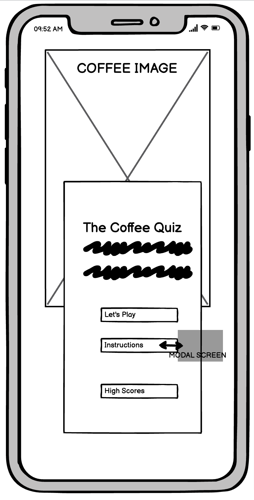

<h1 align="center">The Coffee Quiz</h1>

[View the live project here.](https://vgopal02.github.io/CoffeeQuiz/)

This is a fun quiz designed to test the  knowledge of all coffee lovers and even those who are not. Based on a set of hardcoded questions the user is tested to 5 random questions each time they play.Each correct answer is worth 10 points. A score card at the top of the screen keeps score and also allows the user to see which question they are on. Upon completion of the quiz a final the user may save their score with the option to play again.  

<h2 align="center"></h2>

#  User Experience (UX)

-   ### User stories

    -   #### First Time Visitor Goals

        1. As a First Time Visitor, I want to easily understand the theme of the quiz , instructions on how to play and ability to play it.
        2. As a First Time Visitor, I want to be able to easily navigate throughout the site to find content and correct option to proceed.
        3. As a First Time Visitor, I want to be able to play , record my score and view it easily.
    

    - #### Returning Visitor Goals

        1. As a Returning Visitor, I want to be able to play the quiz with different questions.

    - #### Frequent User Goals

        1. As a Frequent User, I want to be challenged to new questions in the quiz everytime.
        2. This will require a large database of questions.

-   #### Design

    - #### Color Scheme

    The main colors used 
        Colors used been inspired by coffee image. The main colors used are :
       
 1. #fddcc356 

       
 2. #6b7a8f 
 
       
 3. #f7882f 
 
       
 White & Black for Typography. 
 
       
 Red and Green to highlight correct and incorrect answers in quiz. 
 
 
    - #### Typography
        
The Montserrat font is the main font used throughout the whole website with Sans Serif as the fallback font in case for any reason the font isn't being imported into the site correctly. Montserrat is a clean font used frequently in programming, so it is both attractive and appropriate.

    - #### Imagery
        
 Imagery is important.The homepage image is designed to be striking and catch the user's attention. However, the use of imagery is limited in the site so as to not distract the user from the key the objective of the site which is to play the quiz. 

  #  Wireframes 
  
  - 
Wireframes have been created using Balsamiq.

    
    -  #### Home
    

       
        
        

    - #### Quiz Page
    

       
        
        

    - #### Final Page
    

       
        
        

    

# Features

   -  ## Home Page
        -   The user is welcomed into the site with striking image whilst ensuring focus of attention remains the quiz .
        -   The user has three clear options - to be able to play the game , view instructions of the game or to view highscores generated so far.
        - The instructions option opens up a modal where the user is able to understand how to proceed further.
        -   The page is responsive on all device sizes

 

       
       
       

       
        

  -  ## Quiz Page
        -   Quiz Page.

 

       
       
       
        

-  ## Final Page
    -   Final Page.

 

       
       
       
        

-  ## High Scores Page
    -   High Page.

 

       
       
       
        

